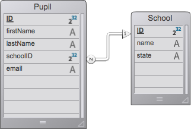

# HDI: ORDA, Objects and Collections

  

A 4D **"How Do I" (HDI)** example showing how to link objects and collections with entities through **ORDA**.


## Overview

| | |
|---|---|
| **Topic** | ORDA: converting entities and entity selections to objects and collections, and writing them back |
| **Original version** | 4D v17 (binary database) |
| **Project version** | 4D 21.1 (project mode) |
| **Required licenses** | None |
| **Languages** | English, Japanese |

## What you will learn

The demo form has four tabs that walk through the topic:

1. **Introduction** -- the concept in brief.
2. **Entities to objects and collections** -- select pupils or schools, choose which attributes to extract, and see the resulting object or collection.
3. **Objects to entities** -- edit a JSON object, then create a new pupil or update an existing one.
4. **Collections to entities** -- create and update several pupils in one call.

## Points of interest

| Technique | Where | Notes |
|---|---|---|
| `entity.toObject(filter; options)` | `pupilToObjectButton`, `schoolToObjectButton` | Filter by attribute path, e.g. `"school.name"`, `"school.*"`, `"pupils.lastName"` |
| `entitySelection.toCollection(filter; options)` | `pupilsToCollectionButton`, `schoolsToCollectionButton` | Same filters, applied to every entity in the selection |
| `dk with primary key`, `dk with stamp` | same buttons | Adds `__KEY` and `__STAMP` so the result can be saved back |
| `entity.fromObject()` | `Button2`, `Button3` | Updates an existing entity or creates a new one, depending on `__KEY` |
| `dataClass.fromCollection()` | `Button6`, `buildDataFromJSON` | Creates or updates many entities in one call |
| Related entities | `school` / `pupils` relations | Navigate N-to-1 and 1-to-N with the same dot notation |
| Collection list boxes | `HDI2` form | Bound to `Form.pupils`, `Form.schools` with `This.attribute` expressions |
| Data seeding | `00_Start` | Empty dataclasses are filled from `Resources/*.4ie` with `IMPORT DATA` |

### Data model



`Pupil` (`firstName`, `lastName`, `email`) belongs to a `School` (`name`, `state`) through the `school` / `pupils` relation. The `INFO` table holds the text displayed on each tab.

## Getting started

1. Open `Project/HDI_ORDA_Objects_And_Collections.4DProject` with 4D 21.1 or later.
2. Choose **File > Demo** (`Cmd/Ctrl+K`), or let the startup method open the splash for you.
3. Click **Demo** and work through the tabs.

The *Trace* check box calls `TRACE` in each button method so you can step through the ORDA code.

## Project structure

```
Project/Sources/
  Methods/           00_Start (entry point), initPages, buildDataFromJSON, RW
  Forms/HDI          splash dialog
  Forms/HDI2         demo dialog with tabs and list boxes
  styleSheets*.css   dark mode and Liquid Glass styling
Resources/
  en.lproj, ja.lproj XLIFF localisation
  *.json             sample objects and collections used by the demo
  *.4ie / *.4si      seed data for the dataclasses
```

## Implementation notes

Conventions shared by the HDI repositories:

- **Startup**: `00_Start` runs through `CALL WORKER` and opens the forms with non-blocking `DIALOG(...; *)`. Running it again brings the existing window to the front.
- **Localisation**: UI text lives in XLIFF files. Forms use `:xliff:` references; methods use `Localized string`.
- **Appearance**: colours use `"automatic"` values and CSS classes with `prefers-color-scheme` rules, so dark mode works. Buttons are sized per theme (27 px Liquid Glass, 23 px classic macOS) in `styleSheets_mac.css`.
- **Language**: `var` and `#DECLARE` replace the deprecated `C_*` directives. Helper methods are marked invisible so only entry points show in the **Run Method** dialog.
- **List boxes**: ellipsis truncation is off and `resizingMode` is `legacy`.

## References

- Blog: [ORDA: work with objects and collections](https://blog.4d.com/orda-work-with-objects-and-collections/)
- Original download: [HDI_ORDA_Objects_And_Collections.zip](https://download.4d.com/Demos/4D_v17/HDI_ORDA_Objects_And_Collections.zip)
- Docs: [ORDA](https://developer.4d.com/docs/ORDA/overview), [Entities](https://developer.4d.com/docs/ORDA/entities), [`entity.toObject()`](https://developer.4d.com/docs/API/EntityClass#toobject), [`entitySelection.toCollection()`](https://developer.4d.com/docs/API/EntitySelectionClass#tocollection), [`dataClass.fromCollection()`](https://developer.4d.com/docs/API/DataClassClass#fromcollection)

## Origin

Converted from the 4D v17 binary database to a project with the 4D 21 conversion tool, then modernised with GitHub Copilot.

## License

[MIT](LICENSE)
